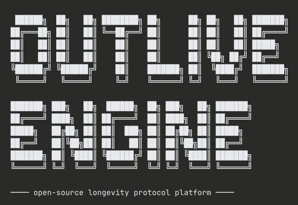

<p align="center">
  
</p>

# Outlive Engine

Open-source longevity protocol platform. Feed it your health data — bloodwork, genetics, wearables, body composition — and it generates a personalized daily protocol across training, nutrition, supplements, interventions, and sleep.

Your data stays on your hardware. Your models run locally. No cloud dependency required.

## Quick Start

You need **Node.js 20+**, **Python 3.11+**, and **PostgreSQL 15+** installed.

```bash
git clone https://github.com/ChrisDover/outlive-engine.git
cd outlive-engine
make setup    # Creates DB, generates secrets, installs deps, bootstraps schema
make dev      # Starts backend (port 8000) and frontend (port 3000)
```

Open [http://localhost:3000](http://localhost:3000), create an account, and you're in.

> **Note:** `make setup` assumes passwordless local PostgreSQL (the default on Mac/Linux dev machines). If your Postgres requires a password, see [Advanced Setup](#advanced-setup) below.

### What to do after setup

1. **Create an account** at http://localhost:3000/signup
2. **Log bloodwork** — click Bloodwork → "Add Your First Panel" and enter your latest lab results (presets included for common markers like testosterone, lipids, HbA1c)
3. **Track body composition** — log weight, body fat, lean mass to see trends over time
4. **Add genomic risks** — enter risk categories from 23andMe, Nebula, or other testing
5. **Run an experiment** — design an N=1 test for a supplement or protocol change
6. **Ask AI** — go to Insights and ask questions about your data (requires [Ollama](https://ollama.ai) or a cloud LLM key)

The dashboard shows a getting-started checklist that tracks your progress.

### API docs

Once the backend is running, interactive API docs are at:

- **Swagger UI:** http://localhost:8000/docs
- **ReDoc:** http://localhost:8000/redoc

All 31 endpoints are documented with request/response schemas.

## Architecture

```
Browser → Next.js (web/) → FastAPI Backend (backend/)
                                    ↓
                              PostgreSQL (all health data)
```

- **Web frontend:** Next.js 16, React 19, TypeScript, Tailwind CSS v4
- **Backend API:** FastAPI, asyncpg, PostgreSQL
- **AI:** Local LLMs by default (Ollama), optional cloud LLM support
- **Database:** Single PostgreSQL database shared between frontend auth and backend health data

## What It Tracks

| Domain | Description |
|--------|-------------|
| **Bloodwork** | Biomarker tracking with optimal ranges, flags, and panel history |
| **Body Composition** | Weight, body fat, lean mass, waist — with trend charts |
| **Genomics** | Genetic risk categories (APOE, MTHFR, etc.) informing protocols |
| **Experiments** | N=1 experiment tracker with snapshots and status management |
| **Training** | Workout programming adjusted by recovery zone |
| **Nutrition** | Calorie and macro targets tuned to activity and goals |
| **Supplements** | Personalized stack informed by bloodwork and genetics |
| **Interventions** | Sauna, cold plunge, breathwork, red light scheduling |
| **Sleep** | Target bedtime/wake, sleep hygiene protocols |

## Security Model

**Your health data is yours.** Outlive Engine is designed for self-hosting with security as a first-class concern:

- **All sensitive fields encrypted at rest** with AES-256-GCM (field-level encryption)
- **No telemetry, no analytics, no phone-home** — zero data leaves your machine
- **Local LLMs by default** via Ollama — your health data never hits external APIs
- **Optional cloud LLM support** (OpenAI, Anthropic) if you choose — clearly gated behind explicit configuration
- **Startup validation** — app refuses to start with default/missing secrets
- **Rate limiting** on all auth and write endpoints
- **Audit logging** on every API request
- **Token revocation** with refresh token rotation
- **Constant-time key comparison** — timing-attack resistant service auth
- **HKDF-SHA256 key derivation** for encryption keys
- **Security response headers** on all API and web responses

See [SECURITY.md](SECURITY.md) for the full security policy and self-hosting hardening guide.

## Local AI Setup

Outlive Engine uses [Ollama](https://ollama.ai) for local AI by default — your health data never leaves your machine.

```bash
ollama pull llama3.1           # Or any model you prefer
```

Set `AIRLLM_BASE_URL=http://localhost:11434/v1` in `backend/.env` (this is the default).

### Using Cloud LLMs Instead

If you prefer cloud models, set these in `backend/.env`:

```bash
# OpenAI
AIRLLM_BASE_URL=https://api.openai.com/v1
AIRLLM_API_KEY=sk-...
AIRLLM_MODEL=gpt-4o

# Or Anthropic
AIRLLM_BASE_URL=https://api.anthropic.com/v1
AIRLLM_API_KEY=sk-ant-...
AIRLLM_MODEL=claude-sonnet-4-20250514
```

**Be aware:** when using cloud LLMs, your health context is sent to external APIs. Use local models if data sovereignty is important to you.

## Advanced Setup

If `make setup` doesn't work for your environment (e.g. Postgres requires a password), you can set up manually:

```bash
# 1. Backend
cd backend
cp .env.example .env          # Edit with your values — generate secrets per the comments
python3 -m venv .venv && .venv/bin/pip install -r requirements.txt
.venv/bin/uvicorn app.main:app --reload

# 2. Web Frontend (in a separate terminal)
cd web
cp .env.example .env          # Edit with your values
npm install
npx prisma db push            # Create auth tables
npm run dev
```

Both `.env.example` files document every variable with generation commands. The backend creates all health data tables on startup.

## Environment Variables

### Backend (`backend/.env`)

| Variable | Description | Required |
|----------|-------------|----------|
| `DATABASE_URL` | PostgreSQL connection string | Yes |
| `JWT_SECRET` | Secret for signing JWT tokens | Yes (app won't start without it) |
| `FIELD_ENCRYPTION_KEY` | 32-byte base64 key for field encryption | Yes (app won't start without it) |
| `SERVICE_API_KEY` | Shared key for web → backend auth | Yes for web frontend |
| `AIRLLM_BASE_URL` | LLM API endpoint (Ollama, OpenAI, etc.) | No (defaults to localhost Ollama) |
| `ALLOWED_ORIGINS` | CORS origins (no wildcards allowed) | Yes |

### Web (`web/.env`)

| Variable | Description |
|----------|-------------|
| `POSTGRES_PRISMA_URL` | PostgreSQL connection (shared database with backend) |
| `NEXTAUTH_SECRET` | Secret for NextAuth session encryption |
| `NEXTAUTH_URL` | Public URL of the web app |
| `OUTLIVE_BACKEND_URL` | FastAPI backend URL |
| `OUTLIVE_SERVICE_KEY` | Must match backend's `SERVICE_API_KEY` |

## Makefile Commands

| Command | Description |
|---------|-------------|
| `make setup` | One-command bootstrap: creates DB, generates secrets, installs deps, bootstraps schema |
| `make dev` | Starts backend and frontend with clean Ctrl-C shutdown |
| `make reset` | Drops DB, removes .env files, re-runs setup from scratch |

## Wearable Integrations

| Device | Status | Auth |
|--------|--------|------|
| Oura Ring | Planned | OAuth 2.0 |
| Whoop | Planned | OAuth 2.0 + PKCE |

## Project Structure

```
├── Makefile              # setup, dev, reset commands
├── SECURITY.md           # Security policy and hardening guide
├── backend/              # FastAPI backend
│   ├── app/
│   │   ├── routers/      # API endpoints (auth, bloodwork, genomics, etc.)
│   │   ├── models/       # Database schema + Pydantic schemas
│   │   ├── security/     # Auth, audit logging, encryption
│   │   └── services/     # AI service, sync engine
│   └── docker-compose.yml
└── web/                  # Next.js web frontend
    ├── src/
    │   ├── app/          # Pages and API routes
    │   ├── components/   # UI components (cards, forms, charts)
    │   └── lib/          # Auth, Prisma, backend client, encryption
    └── prisma/           # Auth schema (shared database)
```

## Contributing

Contributions welcome. Please:

1. Fork the repo
2. Create a feature branch
3. Ensure `npm run build` passes in `web/`
4. Submit a PR

## License

MIT License. See [LICENSE](LICENSE).

---

Built for people who take their health seriously and want full control of their data.
